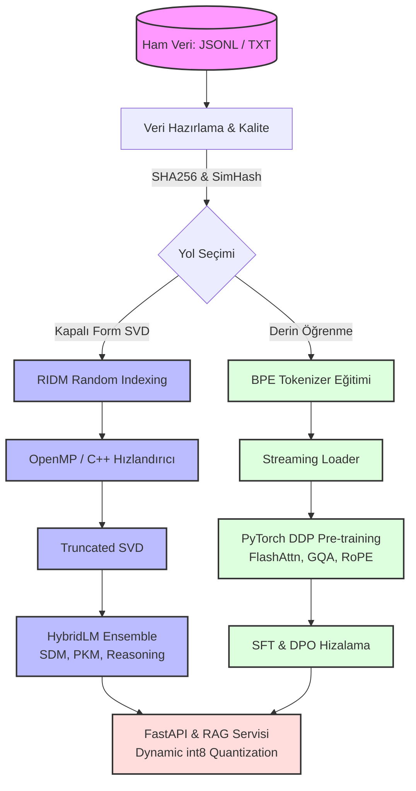

<div align="center">
  
  
  
  
  <br>

  <h1>🌌 RIDM Ultra v6</h1>

  <strong>Yeni Nesil Hibrit Kapalı-Form & OTO-Regresif Dil Modeli Ekosistemi</strong>

  <br>
  <br>
  
  <p>
    <a href="https://github.com/Abdullah6262637/Ridm-Ultra"></a>
    <a href="https://github.com/Abdullah6262637/Ridm-Ultra/blob/main/LICENSE"></a>
    <a href="https://pytorch.org/"></a>
    <a href="https://developer.nvidia.com/cuda-toolkit"></a>
  </p>

  <p>
    <i>Kapalı-Form Kesilmiş SVD, Rastgele İndeksleme (Random Indexing), Hibrit N-Gramlar, PKM Bellek ve Gerçek Zamanlı Transformer (FlashAttention) mimarisini bir araya getiren devasa bir dil modeli araştırma ve üretim ekosistemi.</i>
  </p>
</div>

<hr>

## ✨ Öne Çıkan Özellikler

- ⚡ **Ultra Hızlı C++ Çekirdek:** AVX2/AVX-512 SIMD destekli donanım farkındalıklı (hardware-aware) matris çarpımları ve OpenMP paralelliği.
- 🧠 **RIDM Hibrit Motoru:** Olasılıksal N-gram, İlişkisel Bellek (SDM/PKM), Entropi Tabanlı Reasoning ve Extreme Learning Machine (ELM) katmanlarıyla donatılmış yenilikçi kapalı-form SVD yaklaşımı.
- 🚀 **Gerçek Transformer LLM Altyapısı:** PyTorch tabanlı FlashAttention, RoPE (Rotary Position Embeddings), GQA (Grouped Query Attention), SwiGLU ve KV-Cache ile modern, devasa dil modeli eğitimi ve çıkarımı.
- 🛡️ **Güvenlik & Hizalama (Alignment):** SFT (Supervised Fine-Tuning), DPO (Direct Preference Optimization), PII veri temizliği ve Red-Team problama test bataryaları.
- 📡 **API & RAG Servisleri:** Düşük bellek tüketimi için int8 Dinamik Kuantizasyon (Dynamic Quantization), FastAPI tabanlı REST sunucusu ve sıfır bağımlılıklı Okapi BM25 RAG entegrasyonu.

---

## 🏗️ Sistem Mimarisi & Veri Akışı

RIDM Ultra, eğitim verisini alır ve eşzamanlı olarak hem devasa hızlı kapalı-form vektör uzaylarını inşa eder hem de derin Transformer modellerini eğitir.



---

## 🚀 Hızlı Başlangıç (Quick Start)

Yerel donanımınızı ve Python ortamınızı hazırladıktan sonra projeyi kurmak çok basittir:

```bash
# Repoyu klonlayın
git clone https://github.com/Abdullah6262637/Ridm-Ultra.git
cd Ridm-Ultra

# Bağımlılıkları yükleyin (LLM, Serving ve Test eklentileriyle)
pip install -e ".[llm,serving]"
```

### 1. Kapalı-Form Modeli Eğitimi (SVD Çekirdeği)

Geleneksel geriyayılım (backprop) beklemeden, metin veriniz üzerinden dakikalar içinde yüksek kaliteli kelime uzayları elde edin.

<details>
<summary><b>🛠️ CLI Komutlarını Göster (Tıklayın)</b></summary>
<br>

```powershell
# C++ / CUDA Hızlandırmasıyla Otomatik Eğitim
ridm-ultra --corpus-file data.txt --profile balanced --backend auto --threads 8 --save-model artifacts/model.npz

# Yalnızca PyTorch & CUDA Kullanarak Eğitim
ridm-ultra --corpus-file data.txt --backend torch --device cuda --save-model artifacts/model.npz
```

**Python API Kullanımı:**
```python
from ridm_ultra import TextDataset, Trainer, TrainingConfig

data = TextDataset.from_file("ders_notlari.txt")
config = TrainingConfig(dim=512, rank=128, batch_size=65536, backend="auto", threads=8)

trainer = Trainer(config)
result = trainer.fit(data)
trainer.save(result, "artifacts/ridm")

print(f"Başarı: {result.validation}, Backend: {result.backend}")
```
</details>

### 2. Gerçek Transformer LLM Eğitimi

Milyarlarca tokeni işleyebilen, çoklu GPU uyumlu (DDP) tam teşekküllü LLM hattı.

<details>
<summary><b>🛠️ CLI Komutlarını Göster (Tıklayın)</b></summary>
<br>

**1. Veri Hazırlığı ve Temizliği:**
```powershell
python -m ridm_ultra.llm.cli prepare-data --data raw\*.jsonl --output data\clean.jsonl --dedup-db data\dedup.sqlite
```

**2. Tokenizer Eğitimi:**
```powershell
python -m ridm_ultra.llm.cli tokenizer --data data\clean.jsonl --output artifacts\tokenizer.json --vocab-size 32000
```

**3. Çoklu-GPU (Distributed) Pre-training:**
```powershell
torchrun --standalone --nproc_per_node=4 -m ridm_ultra.llm.cli pretrain \
  --data data\clean.jsonl \
  --tokenizer artifacts\tokenizer.json \
  --output artifacts\llm-50m \
  --seq-len 1024 --hidden 512 --layers 8 --heads 8 --kv-heads 2
```

**4. Model Çıkarımı (Inference):**
```powershell
python -m ridm_ultra.llm.cli generate \
  --tokenizer artifacts\tokenizer.json \
  --checkpoint artifacts\llm-50m\checkpoint-latest.pt \
  --prompt "Yapay zeka sistemleri" \
  --max-new-tokens 120
```
</details>

---

## 🛠️ Modüler Katmanlar

Projeye entegre edilmiş ileri seviye yapay zeka araştırma alt modülleri:

| Alt Paket | İçerik | Detaylar |
| :--- | :--- | :--- |
| 🛡️ `align/` | SFT & DPO | Maskelenmiş fine-tuning ve tercih hizalaması. |
| 🔒 `safety/` | PII & Red-Team | Çıktı sansürleme, kişisel veri koruması, kabul testleri. |
| 🔍 `retrieval/` | BM25 RAG | Dış model indirme gerektirmeyen bağımlılıksız metin indeksleme. |
| 🚀 `serving/` | FastAPI & Quant | CPU odaklı int8 dinamik kuantizasyonlu web API'si. |
| 💬 `chat/` | Chat Engine | Semantik yönlendiricili asenkron (streaming) diyalog motoru. |

---

## ⚖️ Lisans

Bu proje **MIT Lisansı** altında lisanslanmıştır. Daha fazla detay için [LICENSE](LICENSE) dosyasına bakabilirsiniz.

<br>

<div align="center">
  <i>"Ridm Ultra ile sınırları zorlayın. Hızlı, güçlü ve deterministik."</i><br><br>
  <b><a href="#-ridm-ultra-v6">Yukarı Dön ⬆️</a></b>
</div>
