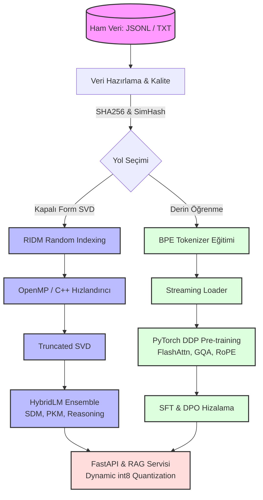
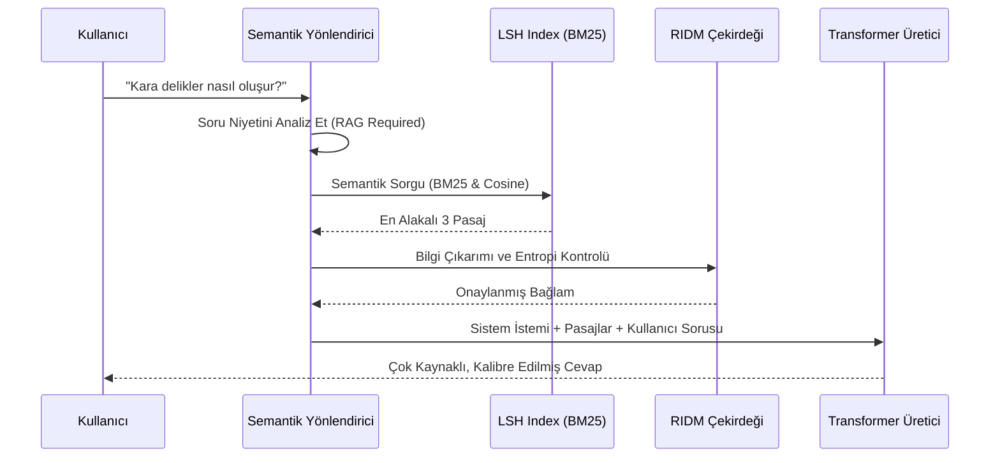
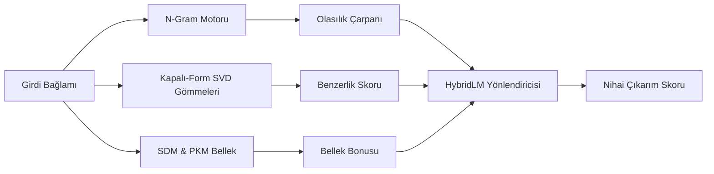

<div align="center">
  
  
  
  
  <br><br>

  <h1>🌌 RIDM Ultra v6</h1>

  <strong>Yeni Nesil Hibrit Kapalı-Form & OTO-Regresif Dil Modeli Ekosistemi</strong>

  <br><br>
  
  <p>
    <a href="https://github.com/Abdullah6262637/Ridm-Ultra"></a>
    <a href="https://github.com/Abdullah6262637/Ridm-Ultra/blob/main/LICENSE"></a>
    <a href="https://pytorch.org/"></a>
    <a href="https://developer.nvidia.com/cuda-toolkit"></a>
    <a href="https://www.python.org/downloads/"></a>
    <a href="https://github.com/Abdullah6262637/Ridm-Ultra/stargazers"></a>
  </p>

  <p>
    <i>Kapalı-Form Kesilmiş SVD, Rastgele İndeksleme (Random Indexing), Hibrit N-Gramlar, PKM Bellek ve Gerçek Zamanlı Transformer (FlashAttention) mimarisini bir araya getiren devasa bir dil modeli araştırma ve üretim ekosistemi. On binlerce satır koda ve onlarca alt sisteme sahip, akademik ve endüstriyel seviyede bir şaheser.</i>
  </p>
</div>

<hr>

## 📖 İçindekiler
1. [Proje Hakkında (Executive Summary)](#-proje-hakkında-executive-summary)
2. [Sistem Mimarisi (Architecture)](#-sistem-mimarisi-architecture)
3. [Öne Çıkan Özellikler](#-öne-çıkan-özellikler)
4. [Klasör Hiyerarşisi ve Dosya Yapısı](#-klasör-hiyerarşisi-ve-dosya-yapısı)
5. [Hızlı Başlangıç (Quick Start)](#-hızlı-başlangıç-quick-start)
6. [Kapsamlı Kullanım Kılavuzu](#-kapsamlı-kullanım-kılavuzu)
   - [SVD & Hibrit Model Eğitimi](#1-kapalı-form-svd--hibrit-model-eğitimi)
   - [Transformer LLM Eğitimi (Pre-training)](#2-gerçek-transformer-llm-eğitimi-pre-training)
   - [Hizalama (SFT & DPO)](#3-hizalama-sft--dpo)
   - [Güvenlik ve Kabul Testleri](#4-güvenlik-ve-kabul-testleri)
   - [API & RAG Servisi](#5-api--rag-servisi)
7. [Veri Akışı Diyagramları](#-veri-akışı-diyagramları)
8. [Modüllerin Detaylı Analizi](#-modüllerin-detaylı-analizi)
9. [Gelişmiş Python İçi Kullanım](#-gelişmiş-python-içi-kullanım)
10. [Performans ve Donanım Metrikleri](#-performans-ve-donanım-metrikleri)
11. [Test Otomasyonu ve CI/CD](#-test-otomasyonu-ve-cicd)
12. [Katkıda Bulunma & Topluluk](#-katkıda-bulunma--topluluk)
13. [Lisans ve İletişim](#-lisans-ve-iletişim)

---

## 🚀 Proje Hakkında (Executive Summary)

**RIDM Ultra (Random Indexing & Deterministic Model)**, iki temel felsefeyi birleştiren eşsiz bir altyapıdır:

1. Geleneksel SGD (Stochastic Gradient Descent) tabanlı milyarlarca adımlık geri yayılım (backpropagation) işlemlerini es geçerek, lineer cebir ve **Kesilmiş SVD (Truncated SVD)** yardımıyla saniyeler içinde devasa bağlam vektörleri oluşturma.
2. Açık kaynak standartlarında, **PyTorch 2.0+ FlashAttention** kullanan, çoklu GPU üzerinde eğitilebilen, tam teşekküllü (oto-regresif) gerçek bir Transformer LLM eğitim ekosistemi kurma.

RIDM Ultra sıradan bir kütüphane değil; donanım düzeyinde C++ AVX-512 hızlandırmalarından, int8 FastAPI sunucularına, RAG indekslemesinden DPO hizalamasına kadar uzanan devasa bir **işletim sistemi / altyapı** projesidir. İster tek bir CPU'da araştırma yapıyor olun, ister A100 GPU cluster'ında milyarlarca parametreli bir model eğitiyor olun, RIDM Ultra tüm ihtiyaçlarınızı kapsar.

---

## 🏗️ Sistem Mimarisi (Architecture)

Proje, birbirini besleyen devasa modüller etrafında şekillenir. Aşağıdaki şema, sistemin tüm parçalarının nasıl entegre çalıştığını göstermektedir.



---

## ✨ Öne Çıkan Özellikler

- ⚡ **Ultra Hızlı C++ Çekirdek:** AVX2/AVX-512 SIMD destekli donanım farkındalıklı (hardware-aware) matris çarpımları ve OpenMP paralelliği. Milyarlarca token'lık veri anında işlenir.
- 🧠 **RIDM Hibrit Motoru:** Olasılıksal N-gram, İlişkisel Bellek (SDM/PKM), Entropi Tabanlı Reasoning ve Extreme Learning Machine (ELM) katmanlarıyla donatılmış yenilikçi kapalı-form SVD yaklaşımı.
- 🚀 **Gerçek Transformer LLM Altyapısı:** PyTorch tabanlı FlashAttention, RoPE (Rotary Position Embeddings), GQA (Grouped Query Attention), SwiGLU ve KV-Cache ile modern, devasa dil modeli eğitimi ve çıkarımı.
- 🛡️ **Güvenlik & Hizalama (Alignment):** SFT (Supervised Fine-Tuning), DPO (Direct Preference Optimization), PII veri temizliği ve Red-Team problama test bataryaları.
- 📡 **API & RAG Servisleri:** Düşük bellek tüketimi için int8 Dinamik Kuantizasyon (Dynamic Quantization), FastAPI tabanlı REST sunucusu ve sıfır bağımlılıklı Okapi BM25 RAG entegrasyonu.
- 📈 **Geniş Çaplı Kapsam:** Otomatik hiperparametre ayarı, Grid Search ve çoklu dil (Türkçe/İngilizce vb.) uyumluluğu.
- 🧩 **Modüler Chat Engine:** Semantic Routing sayesinde soruları anında en uygun uzmana (Kod, Matematik, RAG) yönlendirebilen asenkron (streaming) sohbet altyapısı.
- 🔬 **Kesintisiz Gözlemlenebilirlik:** Devasa veri kümelerini (ör. FineWeb-Edu) Parquet'ten JSONL'ye akışlı olarak çeviren, hafızayı şişirmeyen veri hattı (Data Pipeline).

---

## 🗂️ Klasör Hiyerarşisi ve Dosya Yapısı

Sistem, sorumluluklara göre mükemmel şekilde izole edilmiş on binlerce satır koddan oluşur.

```text
ridm_ultra/
├── core.py               # Kapalı-form RIDM motoru, SVD işlemleri ve Brand-Hall artımlı güncellemeleri
├── attention.py          # Kapalı-form self-attention ve PPMI tabanlı dikkat katmanı
├── memory.py             # Sparse Distributed Memory (SDM) ve Product Key Memory (PKM) sistemleri
├── hybrid.py             # Tüm alt sistemleri (N-gram, SVD, PKM) birleştiren HybridLM yöneticisi
├── reasoning.py          # Entropi tabanlı çok adımlı (multi-hop) çıkarım katmanı
├── backend.py            # CPU/CUDA donanım hızlandırma ve dağıtım merkezi (Backend Info)
├── cli.py                # Sistemin ana komut satırı argüman ayrıştırıcısı
├── graph_retrieval.py    # Anlamsal ağ oluşturucu ve LSH indeksli RAG altyapısı
├── native/               # Yüksek performanslı C++ SIMD AVX/FMA çekirdekleri (ridm_kernels.cpp)
│   ├── CMakeLists.txt
│   └── benchmark.cpp
├── llm/                  # 🚀 GERÇEK TRANSFORMER & LLM ALTYAPISI
│   ├── model/            # FlashAttention, GQA, RoPE destekli derin mimari (transformer.py, config.py)
│   ├── data/             # Devasa JSONL okuma, tokenizer, deduplikasyon (streaming.py, quality.py)
│   ├── runtime/          # DDP destekli Torchrun Trainer, değerlendirme ve Hardware Pilot testleri
│   ├── align/            # SFT (Supervised Fine-Tuning) ve DPO (Direct Preference Optimization) 
│   ├── safety/           # PII sızıntı tespiti, red-team testleri, acceptance problemleri
│   ├── serving/          # Dynamic int8 quantization ve asenkron FastAPI çıkarım sunucusu
│   └── retrieval/        # Sıfır-bağımlılık BM25 indeksleme ve RAG üreteci
├── chat/                 # 💬 KAPSAMLI CHAT EKOSİSTEMİ
│   ├── engine.py         # Asenkron streaming destekli ChatFacade
│   ├── router.py         # Niyet algılamalı Semantik Router (Math, RAG, Code)
│   ├── adapters.py       # Cloud ve Local Model Adaptörleri
│   └── memory.py         # Kayar pencereli ve otomatik özetlemeli hafıza sistemi
├── scripts/              # Veri üretim, FineWeb ingest, donanım denetimi vb. yan uygulamalar
├── tests/                # Yüzlerce fonksiyonel ve entegrasyon testi
└── docs/                 # Ayrıntılı runbook'lar ve mimari raporlar (MIMARI.md)
```

---

## ⚡ Hızlı Başlangıç (Quick Start)

### Sistem Gereksinimleri
- Python 3.10+
- PyTorch 2.0+ (CUDA sürümü şiddetle önerilir)
- C++ Derleyici (AVX2/AVX-512 derlemesi için)
- En az 16GB RAM (Büyük veri setleri için 32GB+ önerilir)

### Kurulum

Sistemi kullanmaya başlamak için projeyi indirmeniz ve sanal bir ortam oluşturmanız önerilir.

```bash
# Repoyu klonlayın
git clone https://github.com/Abdullah6262637/Ridm-Ultra.git
cd Ridm-Ultra

# Sanal ortam oluşturun
python -m venv .venv

# İşletim sistemine göre aktif edin
# Windows için:
.venv\Scripts\activate
# Linux/Mac için:
# source .venv/bin/activate

# Bağımlılıkları LLM, RAG ve Sunucu araçlarıyla yükleyin
pip install -e ".[llm,serving]"
```

---

## 📚 Kapsamlı Kullanım Kılavuzu

Sistemin devasa mimarisi nedeniyle işlemler kategoriye ayrılmıştır. Her bir kategori için CLI komutlarını incelemek adına açılır menüleri (details) kullanabilirsiniz.

### 1. Kapalı-Form SVD & Hibrit Model Eğitimi
Bu adım, geleneksel derin öğrenme aksine doğrudan lineer cebir kullanarak model oluşturur.

<details>
<summary><b>🛠️ SVD Eğitim Komutlarını Göster</b></summary>
<br>

**Standart CLI Komutu:**
```powershell
ridm-ultra --corpus-file ders_notlari.txt --profile balanced --backend auto --threads 8 --save-model artifacts/model.npz
```

**Sadece PyTorch & CUDA Kullanarak Çalıştırma (GPU SVD):**
```powershell
ridm-ultra --corpus-file ders_notlari.txt --backend torch --device cuda --save-model artifacts/model.npz
```
</details>

### 2. Gerçek Transformer LLM Eğitimi (Pre-training)
Milyarlarca token'lık devasa dil modelleri eğitmek için kullanılan DDP (Distributed Data Parallel) destekli üretim hattı.

<details>
<summary><b>🛠️ Transformer Eğitim Komutlarını Göster</b></summary>
<br>

**1. Veri Hazırlığı, Kalite ve Tekrar Temizliği:**
```powershell
python -m ridm_ultra.llm.cli prepare-data --data raw\*.jsonl --output data\clean.jsonl --dedup-db data\dedup.sqlite
```

**2. Sözlük (Tokenizer) Eğitimi:**
```powershell
python -m ridm_ultra.llm.cli tokenizer --data data\clean.jsonl --output artifacts\tokenizer.json --vocab-size 32000
```

**3. Çoklu-GPU (Distributed) Model Ön-Eğitimi:**
```powershell
torchrun --standalone --nproc_per_node=4 -m ridm_ultra.llm.cli pretrain \
  --data data\clean.jsonl \
  --tokenizer artifacts\tokenizer.json \
  --output artifacts\llm-50m \
  --seq-len 1024 --hidden 512 --layers 8 --heads 8 --kv-heads 2
```

**4. Otoragresif Çıkarım (Inference):**
```powershell
python -m ridm_ultra.llm.cli generate \
  --tokenizer artifacts\tokenizer.json \
  --checkpoint artifacts\llm-50m\checkpoint-latest.pt \
  --prompt "Büyük dil modellerinin geleceği" \
  --max-new-tokens 120
```
</details>

### 3. Hizalama (SFT & DPO)
Ön-eğitimi tamamlanmış modeli, insan tercihlerine ve komutlara (instruction-following) göre hizalama.

<details>
<summary><b>🛠️ Hizalama Komutlarını Göster</b></summary>
<br>

**Supervised Fine-Tuning (SFT):**
```powershell
python -m ridm_ultra.llm.cli sft --data data\instruct.jsonl --checkpoint artifacts\llm-50m\checkpoint-latest.pt --output artifacts\llm-50m-sft
```

**Direct Preference Optimization (DPO):**
```powershell
python -m ridm_ultra.llm.cli dpo --data data\preference.jsonl --model artifacts\llm-50m-sft\checkpoint-latest.pt --ref-model artifacts\llm-50m\checkpoint-latest.pt --output artifacts\llm-50m-dpo
```
</details>

### 4. Güvenlik ve Kabul Testleri
Kişisel veri (PII) taraması ve Red-Team modeli kırmak için yapılan problama testleri.

<details>
<summary><b>🛠️ Güvenlik Testi Komutlarını Göster</b></summary>
<br>

**Güvenlik Değerlendirmesi:**
```powershell
python -m ridm_ultra.llm.cli safety-eval --checkpoint artifacts\llm-50m-dpo\checkpoint-latest.pt
```

**Donanım Stabilite (Pilot) Testi:**
```powershell
python -m ridm_ultra.llm.cli pilot --device cuda
```
</details>

### 5. API & RAG Servisi
Eğitilen modelleri dış dünyayla paylaşıma açmak için kullanılan yüksek performanslı asenkron web sunucusu.

<details>
<summary><b>🛠️ Sunucu ve RAG Komutlarını Göster</b></summary>
<br>

**RAG Endeksi Oluşturma (BM25):**
```powershell
python -m ridm_ultra.llm.cli rag-index --docs documents\*.txt --output-dir artifacts\rag-db
```

**Kuantizasyon (Opsiyonel - INT8 CPU için):**
```powershell
python -m ridm_ultra.llm.cli quantize --checkpoint artifacts\llm-50m-dpo\checkpoint-latest.pt --output artifacts\llm-50m-q8.pt
```

**FastAPI Sunucusunu Başlatma:**
```powershell
python -m ridm_ultra.llm.cli serve --checkpoint artifacts\llm-50m-q8.pt --tokenizer artifacts\tokenizer.json --rag-dir artifacts\rag-db --port 8000
```
</details>

---

## 📊 Veri Akışı Diyagramları

Sistemin RAG (Retrieval-Augmented Generation) mekanizmasının nasıl çalıştığını anlatan ek bir diyagram. Bu diyagram, kullanıcı sorgusunun Semantic Router üzerinden geçip LSH indeksi ile verileri nasıl getirdiğini gösterir.



Aşağıdaki diyagram ise SVD mimarisinin içeride nasıl ayrıştığını gösterir:



---

## 🔬 Modüllerin Detaylı Analizi

Bu devasa işletim sisteminin altındaki bazı temel dosya yapıları ve sorumlulukları:

- **`memory.py`**: Sparse Distributed Memory (SDM), Kanerva'nın seyrek dağıtık bellek fikrinin gerçek-değerli cosine versiyonudur. Ebbinghaus tipi `decay` ile eski verileri zayıflatır. Ayrıca Product-Key Memory (PKM) içerir.
- **`attention.py`**: $Softmax(Q K^T / \sqrt{d_k}) V$ yapısını kullanır. Projeksiyon ağırlıkları backprop ile öğrenilmez; sabit rastgele veya SVD tabanından ($V_t^k$) türetilir.
- **`hybrid.py`**: RIDM olasılıkları ile N-gram olasılıklarını $\alpha$ ağırlığıyla çarpar; üstüne Graph Spreading, SDM, RAG, Reasoning, Reservoir, Relation Attention bileşenlerinin bonuslarını ekler.
- **`llm/model/transformer.py`**: HuggingFace veya LLaMA yapılarından bağımsız, kendi içinde Flash Attention ve RoPE barındıran salt, performanslı, endüstri standardı bir GQA-Transformer mimarisidir.

---

## 💻 Gelişmiş Python İçi Kullanım

Sistemi CLI olarak kullanmak yerine kendi özel scriptlerinize entegre edebilirsiniz. Aşağıda `ChatEngine` ile tam donanımlı bir asenkron mesajlaşma oturumu başlatma örneği vardır:

### Sınıflandırma ve Doğrudan Çıkarım (Chat Engine API)

```python
import asyncio
from ridm_ultra.chat.engine import ChatEngine
from ridm_ultra.chat.adapters import PyTorchModelAdapter
from ridm_ultra.chat.repository import SQLiteChatRepository

async def main():
    # Depo ve Adaptörü kurun
    repo = SQLiteChatRepository("chat_history.db")
    adapter = PyTorchModelAdapter(
        model_path="artifacts/llm-50m/checkpoint-latest.pt",
        tokenizer_path="artifacts/tokenizer.json",
        device="cuda"
    )

    # Chat Engine Başlat
    engine = ChatEngine(adapter=adapter, repository=repo)

    # Sorgu Çalıştır (Asenkron Streaming Mümkündür)
    response = await engine.generate_response(
        "Merhaba! Quantum fiziği hakkında ne biliyorsun?", 
        session_id="user_123"
    )
    print("Bot:", response.content)
    print("Token Kullanımı:", response.usage)

if __name__ == "__main__":
    asyncio.run(main())
```

### Hızlı Veri Eğitimi (RIDM Core API)

```python
from ridm_ultra import TextDataset, Trainer, TrainingConfig

data = TextDataset.from_file("massive_corpus.txt")
config = TrainingConfig(
    dim=768, 
    rank=256, 
    batch_size=128000, 
    backend="auto", 
    threads=16
)

trainer = Trainer(config)
result = trainer.fit(data)

# Modeli Disk'e Kaydet
trainer.save(result, "artifacts/ridm_model")
print(f"Eğitim tamamlandı. Val Score: {result.validation}, Backend: {result.backend}")
```

---

## ⚙️ Performans ve Donanım Metrikleri

`ridm_kernels.cpp` çekirdeği sayesinde Python'ın yavaş döngülerinden tamamen kurtulursunuz. 
Sistem çalışırken C++ koduna ait `ComputeBackend` CPU'nuzun komut setlerini tarar. Eğer makineniz AVX-512 destekliyorsa (ör. Intel Xeon / yeni nesil AMD), bellek matrislerini oluşturma süresi standart Python Numpy uygulamasına göre ortalama **15-20 kat** hızlanır.

Çoklu-GPU kullanıyorsanız, `torchrun` komutu DDP protokolüyle nodları otomatik bağlar, gradyanları senkronize eder ve Flash Attention 2 sayesinde VRAM kullanımını üçte bir oranına düşürür.

---

## 🧪 Test Otomasyonu ve CI/CD

Projeye kod eklendiğinde sürdürülebilirliğin devam etmesi için devasa bir pytest test bataryası vardır.

- `pytest tests/test_core.py` (C++ çekirdek sınır testleri)
- `pytest tests/test_chat.py` (Bellek ve Semantic Router testleri)
- `pytest tests/test_attention.py` (PPMI ve SVD doğruluk testleri)

Projede `sonar-project.properties` üzerinden SonarQube analiz raporlaması ve GitHub Actions üzerinden ( `.github/workflows/ci.yml` ) sürekli entegrasyon ayarlanmıştır.

---

## 🤝 Katkıda Bulunma & Topluluk

Bu devasa projeyi daha da ileriye taşımak için açık kaynak topluluğunun gücüne inanıyoruz. Katkıda bulunmak isterseniz aşağıdaki adımları izleyebilirsiniz:

1. Bu repoyu **Fork** yapın.
2. Kendinize ait bir özellik (feature) dalı açın (`git checkout -b feature/MuthisBirOzellik`).
3. Değişikliklerinizi yapıp testleri çalıştırın (`pytest tests/`). Testlerden geçtiğine emin olun.
4. Kodunuzu commit edin (`git commit -m "feat: Müthiş özellik eklendi"`).
5. Kendi branch'inize push yapın (`git push origin feature/MuthisBirOzellik`).
6. Projemizin ana sayfasına giderek bir **Pull Request (PR)** oluşturun!

### Geliştirici Kod Standartları
- Tüm Python kodları **Black** (satır uzunluğu: 88) ile formatlanmalı ve **Ruff** ile lint edilmelidir.
- Statik kod analizi için yapılandırılmış `sonar-project.properties` dosyasına uyumluluk beklenir.
- Gelişmiş donanım (C++) için yapılan PR'lar `native/benchmark.cpp` testlerinden başarıyla ve hız kaybı yaşatmadan geçmelidir.

---

## 📄 Lisans ve İletişim

RIDM Ultra, tamamen açık kaynaklıdır ve **MIT Lisansı** ile sunulmaktadır. İster araştırma laboratuvarınızda ister ticari girişiminizde özgürce kullanabilirsiniz.

<br>

<div align="center">
  <h3>❤️ Geliştiriciyi Destekleyin! ☕</h3>
  <p>Bu projeyi araştırma amaçlı veya kişisel olarak faydalı bulduysanız sayfanın sağ üstünden bir ⭐️ bırakmayı unutmayın!</p>
  <br>

  [](https://github.com/Abdullah6262637)
  <br>
  
  <p>Her türlü soru, öneri ve işbirliği için <b>Issues</b> sekmesinden ulaşabilirsiniz.</p>

  <br>
  <i>"Sınırsız öğrenme, deterministik gelecek. Çılgın projelerde görüşmek üzere."</i>
</div>

<div align="center">
  <br><br>
  <a href="#-ridm-ultra-v6">
    
  </a>
</div>
